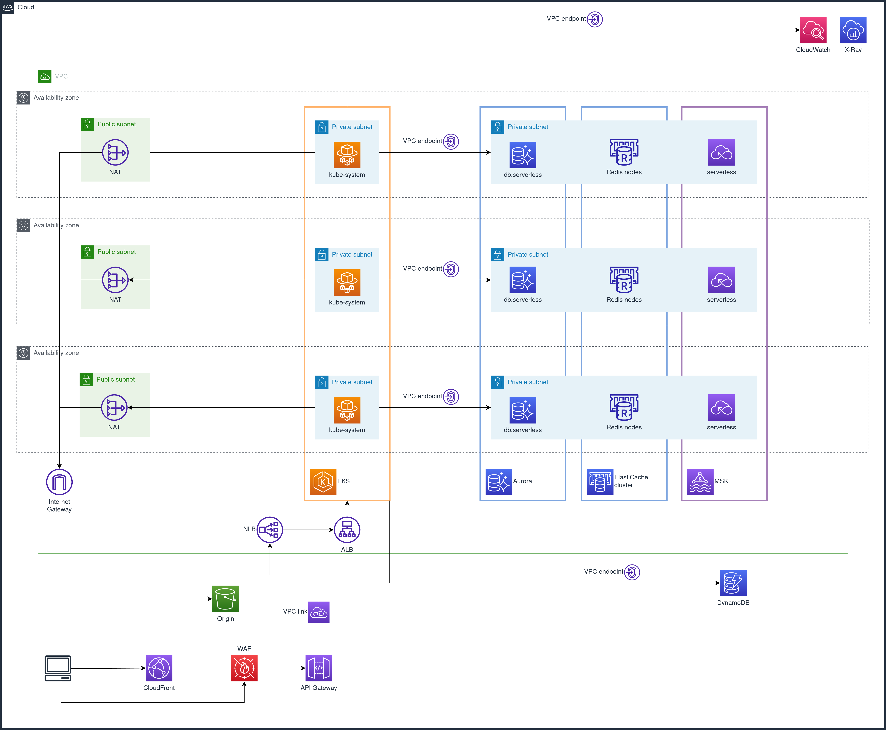

# aws-terraform-eks-template

Terraform template repository for infrastructures projects




## How to use this template

### Terraform folders name convention

Inside the folder `src` we have this folders, that contains the terraform files. Here you can find the meaning of the folders

* init: contains all the resources to provision a Terraform backend;
* core: contains all the basic infrastructure that must be created before to support other layers, and cannot be destroyed every time:
  * for example we can find the dns, vnet or monitoring.
* eks-platform: here you can find the setup of your cluster k8s/eks:
  * for example ingress, rbac, cluster configuration or service accounts.
* domains: here you can find one or more the business applications.

### Change the template name

In this template we use `devopslab` or `dvopla` to define ours project, but you need to change all the information, to be complaint with your project

Inside `src/<module>/env/<environment>/terraform.tfvars` change this informations:

```ts
env_short      = "d"
environment    = "dev"
prefix         = "dvopla"

tags = {
  CreatedBy   = "Terraform"
  Environment = "DEV"
  Owner       = "DevOps"
  Source      = "https://github.com/pagopa/aws-terraform-eks-template"
  CostCenter  = "TS310 - PAGAMENTI & SERVIZI"
}
```

Change the occurrence `dvopla` with the name of your project or the name that is better for you in all folders inside `src/*`.

### Init Terraform backend

Apply the `src/init` module to init all resources needed by Terraform backend:

```sh
cd src/init
./terraform.sh init dev
./terraform.sh apply dev
```

Edit all `src/<module>/env/<environment>/backend.tfvars` accordingly and migrate current state:

```sh
cd src/init
./terraform.sh init dev -migrate-state
```

## Requirements

### 1. terraform

In order to manage the suitable version of terraform it is strongly recommended to install the following tool:

* [tfenv](https://github.com/tfutils/tfenv): **Terraform** version manager inspired by rbenv.

Once these tools have been installed, install the terraform version shown in:

* .terraform-version

After installation install terraform:

```sh
tfenv install
```

## Terraform modules

As PagoPA we build our standard Terraform modules, check available modules:

* [PagoPA Terraform modules](https://github.com/search?q=topic%3Aterraform-modules+org%3Apagopa&type=repositories)

## Apply changes

To apply changes follow the standard terraform lifecycle once the code in this repository has been changed:

```sh
terraform.sh init [dev|uat|prod]

terraform.sh plan [dev|uat|prod]

terraform.sh apply [dev|uat|prod]
```

## Terraform lock.hcl

We have both developers who work with your Terraform configuration on their Linux, macOS or Windows workstations and automated systems that apply the configuration while running on Linux.
<https://www.terraform.io/docs/cli/commands/providers/lock.html#specifying-target-platforms>

So we need to specify this in terraform lock providers:

```sh
terraform init

rm .terraform.lock.hcl

terraform providers lock \
  -platform=windows_amd64 \
  -platform=darwin_amd64 \
  -platform=darwin_arm64 \
  -platform=linux_amd64
```

## Precommit checks

Check your code before commit.

<https://github.com/antonbabenko/pre-commit-terraform#how-to-install>

```sh
pre-commit run -a
```
